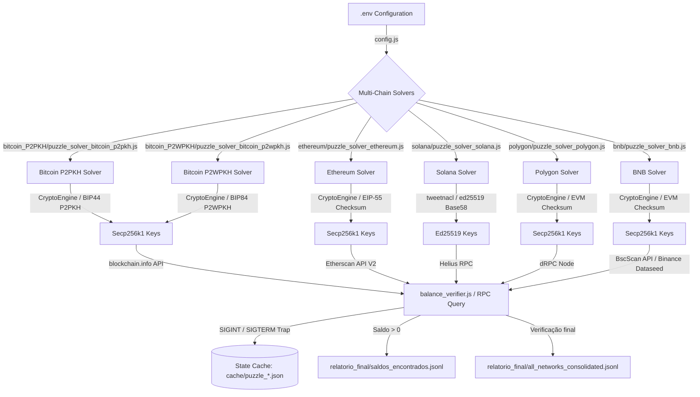

# 🚀 Multi-Chain Crypto Puzzle Solver v4.0

[](https://opensource.org/licenses/MIT)
[](https://nodejs.org)
[](https://python.org)

Solucionador multi-cadeia de alto desempenho para os Puzzles **71**, **72** e **73** do Bitcoin e redes equivalentes. O projeto gera chaves privadas sequencialmente dentro dos ranges específicos de cada puzzle, deriva os endereços correspondentes para 5 blockchains distintas e verifica saldos em tempo real através de APIs e nós RPC de alta velocidade.

> [!IMPORTANT]
> **Modo de Busca Mandatório**: A propriedade `SEARCH_MODE` deve ser obrigatoriamente configurada como `sequential`. O modo `random` não é mais suportado pelas validações internas do `config.js` para garantir consistência matemática e persistência.

---

## 📊 Arquitetura do Sistema

A imagem abaixo ilustra o fluxo de processamento de chaves, derivação de endereços e validação de saldos em todas as redes em paralelo:



---

## 🎯 Puzzles e Alvos Reais (Targets)

O projeto está configurado especificamente para buscar chaves nos seguintes intervalos e endereços-alvo:

| Puzzle | Range de Busca (Mínimo ao Máximo) | Bitcoin Target | Ethereum / Polygon / BNB Target | Solana Target |
| :---: | :---: | :---: | :---: | :---: |
| **71** | `2^70` a `2^71 - 1` | `1PWo3JeB9jrGwfHDNpdGK54CRas7fsVzXU` | `0x00000000219ab540356cBB839Cbe05303d7705Fa` | `4ZJhPQAgUseCsWhKvJLTmmRRUV74fdoTpQLNfKoekbPY` |
| **72** | `2^71` a `2^72 - 1` | `1JTK7s9YVYywfm5XUH7RNhHJH1LshCaRFR` | `0xBE0eB53F46cd790Cd13851d5EFf43D12404d33E8` | `9WzDXwBbmkg8ZTbNMqUxvQRAyrZzDsGYdLVL9zYtAWWM` |
| **73** | `2^72` a `2^73 - 1` | `12VVRNPi4SJqUTsp6FmqDqY5sGosDtysn4` | `0x40B38765696e3d5d8d9d834D8AaD4bB6e418E489` | `7mhcgF1DVsj5iv4CxZDgp51H6MBBwqamsH1KnqXhSRc5` |

---

## ⚙️ Configuração do Ambiente (`.env`)

Copie o template do arquivo `.env` e ajuste suas variáveis de ambiente:

```bash
cp .env.example .env
```

### Configurações de Execução Real

```env
# -------- RUNTIME SETTINGS --------
BATCH_SIZE=1                     # Quantidade de chaves geradas por lote antes da consulta
DELAY_MS=50                      # Atraso em milissegundos entre lotes de busca
MAX_REQ_24H=30000                # Máximo de consultas RPC em 24h para evitar bloqueio
TIMEOUT_MS=3000                  # Limite de espera da requisição RPC (ms)
SEARCH_MODE=sequential           # MANDATÓRIO: sequential (único modo aceito pelo validador)

# -------- BITCOIN CONFIGURATION --------
BLOCKCHAIN_INFO_BASE_URL=https://blockchain.info
BTC_PUBLIC_API_DELAY_MS=2000

# -------- ETHEREUM CONFIGURATION --------
ETH_RPC_ENDPOINT=https://api.etherscan.io/v2/api
ETHERSCAN_KEY=8GS74KI7YYVW3M5V5WZ4SGJHHU85HA6JTX
ETH_DELAY_MS=200

# -------- SOLANA CONFIGURATION --------
SOL_RPC_ENDPOINT=https://mainnet.helius-rpc.com/?api-key=c4127e39-e917-407f-8259-d2e5c6471a7c
SOL_DELAY_MS=110

# -------- POLYGON CONFIGURATION --------
POLYGON_RPC_ENDPOINT=https://lb.drpc.org/ogrpc?network=polygon&dkey=AjCW_JETQkJriSlwdzqDWISeITOjYOwR8Zqu7sA_udJz
POLYGON_API_KEY=https://lb.drpc.org/ogrpc?network=polygon&dkey=AjCW_JETQkJriSlwdzqDWISeITOjYOwR8Zqu7sA_udJz
POLYGON_DELAY_MS=300

# -------- BNB CONFIGURATION --------
BNB_RPC_ENDPOINT=https://bsc-dataseed.binance.org
BSCSCAN_KEY=8GS74KI7YYVW3M5V5WZ4SGJHHU85HA6JTX
BNB_DELAY_MS=200
```

---

## ⏸️ Persistência de Progresso e Salvamento Seguro

Os resolvedores contam com dois mecanismos críticos que garantem a segurança do seu progresso:

1.  **Salvamento Automático em Checkpoint**: O progresso é salvo no arquivo `cache/puzzle_<id>.json` a cada 10 lotes processados, assim como no momento em que rate limits são atingidos.
2.  **Captura de Sinais (`SIGINT` e `SIGTERM`)**: Os scripts de execução (.sh) contam com capturas de interrupção (Ctrl+C). Ao parar o processo, os sinais são propagados de forma limpa como `SIGTERM` para as instâncias do Node.js, fazendo com que salvem a chave atual (`lastPrivkey`) no arquivo de cache antes de finalizarem, evitando processos órfãos rodando em segundo plano.
3.  **Tratamento Decimal e Hexadecimal**: A leitura do progresso suporta chaves no formato decimal de BigInt e hexadecimal (com prefixo `0x`), impedindo que reinicializações do script resetem o progresso acumulado de volta ao zero.

---

## 🚀 Como Executar

### 1. Preparação das Dependências (Toolbox / Host)

Para instalar as dependências de sistema (Node.js v18+, NPM e Python) automaticamente dentro do ambiente de execução do toolbox:

```bash
chmod +x setup_toolbox.sh
./setup_toolbox.sh
```

### 2. Executar Solvers de Busca

Você pode rodar as redes e os puzzles de forma modular ou paralela:

*   **Opção A: Executar todas as redes e puzzles simultaneamente (Modo Master)**
    ```bash
    chmod +x run_all_networks_all_puzzles.sh
    ./run_all_networks_all_puzzles.sh
    ```
*   **Opção B: Executar um puzzle específico em todas as redes**
    ```bash
    ./run_all_networks_puzzle71.sh
    ./run_all_networks_puzzle72.sh
    ./run_all_networks_puzzle73.sh
    ```
*   **Opção C: Executar todos os puzzles de uma única rede**
    ```bash
    ./run_all_puzzles_bitcoin.sh
    ./run_all_puzzles_ethereum.sh
    ./run_all_puzzles_solana.sh
    ./run_all_puzzles_polygon.sh
    ./run_all_puzzles_bnb.sh
    ```

### 3. Verificar Saldos Encontrados

Após deixar os resolvedores executando, você pode consolidar e auditar os relatórios de saldos e transações encontradas:

```bash
# Executa a varredura e consolidação de todas as redes
uv run check_all_networks.py

# Verificadores individuais por rede
uv run check_bitcoin.py
uv run check_ethereum.py
uv run check_solana.py
uv run check_polygon.py
uv run check_bnb.py
```

### 4. Analisar Relatório Final

Os resultados de saldos ativos encontrados são gravados no arquivo unificado:

```bash
# Exibe saldos reais encontrados com a chave WIF/Privkey associada
cat relatorio_final/saldos_encontrados.jsonl
```

---

## 📁 Estrutura Detalhada do Projeto

```
/var/home/recifecrypto/2--71-72-73/
├── config.js                           # Configuração central (.env)
├── run_all_networks_all_puzzles.sh     # Inicializador mestre (todas redes + puzzles)
├── run_all_networks_puzzle*.sh         # Inicializador por puzzle (71, 72 ou 73)
├── check_balance.sh                    # Validador rápido de saldos BTC/ETH
├── setup_toolbox.sh                    # Bootstrap e dependências
├── check_*.py                          # Extratores de saldos por rede
├── check_all_networks.py               # Extrator mestre consolidado
│
├── bitcoin_P2PKH/
│   ├── puzzle_solver_bitcoin_p2pkh.js  # Entry point Bitcoin P2PKH
│   ├── config/                         # Solver, utils, balance_verifier
│   ├── cache/                          # Estado puzzle_71/72/73.json
│   └── logs/
├── bitcoin_P2WPKH/
│   ├── puzzle_solver_bitcoin_p2wpkh.js # Entry point Bitcoin P2WPKH (SegWit)
│   ├── config/
│   ├── cache/
│   └── logs/
├── ethereum/
│   ├── puzzle_solver_ethereum.js
│   ├── config/
│   ├── cache/
│   └── logs/
├── solana/
│   ├── puzzle_solver_solana.js
│   ├── config/
│   ├── cache/
│   └── logs/
├── polygon/
│   ├── puzzle_solver_polygon.js
│   ├── config/
│   ├── cache/
│   └── logs/
├── bnb/
│   ├── puzzle_solver_bnb.js
│   ├── config/
│   ├── cache/
│   └── logs/
│
└── relatorio_final/                    # Resultados consolidados e achados
    ├── saldos_encontrados.jsonl        # Chaves privadas que possuem saldo ativo
    └── all_networks_consolidated.jsonl # Relatório consolidado gerado pelo checker
```

---

## 🛠️ Dependências do Projeto (`package.json`)

*   **`elliptic`**: Criptografia de curva elíptica secp256k1 (Bitcoin/EVM).
*   **`bs58`**: Codificação Base58 (Bitcoin/Solana).
*   **`axios`**: Cliente HTTP robusto para requisições e retry.
*   **`web3` & `web3-utils`**: Manipulação de Keccak256 e conversões EVM.
*   **`js-sha256`**: Computação de assinaturas SHA256 rápidas.
*   **`sha3`**: Operações adicionais de Keccak/Sha3.
*   **`tweetnacl`**: Implementação pura de ed25519 para derivação de endereços Solana.
*   **`@solana/web3.js` & `@solana/spl-token`**: Interação com RPC do ecossistema Solana.
